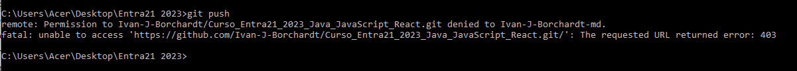
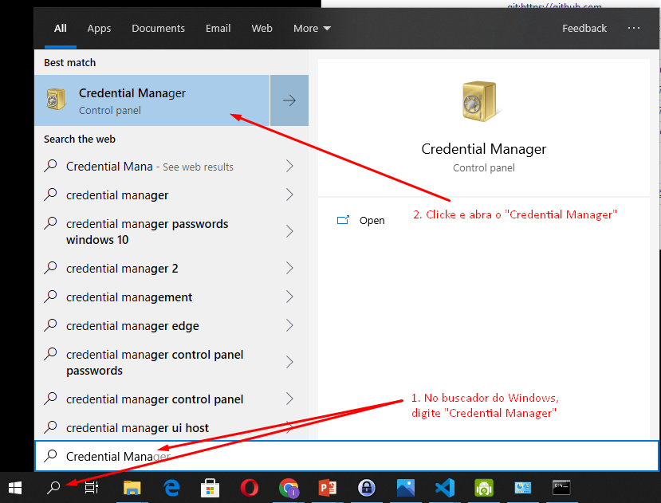
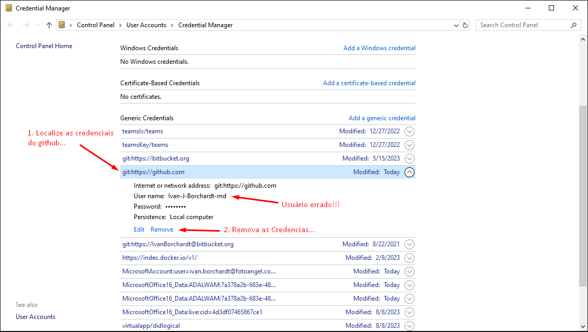
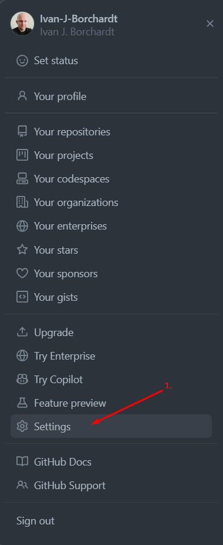
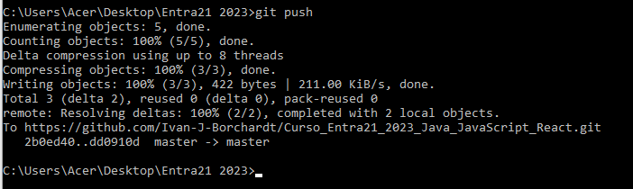

# Problemas e soluções

## Permission Error ao Fazer Push 

**Causa:** O erro acontece porque, no passado, já foi acessada outra conta github, com outro usuário, no mesmo computador, de forma que as credenciais desse outro usuário ficaram registradas no Gerenciador de Credenciais do Sistema Operacional.   
Quando agora se tenta fazer "push" o git está usando as credenciais de outro usuário para acessar a nova conta no GitHub, motivo pelo qual o GitHub está rejeitando a autenticação. 

**Solução:** 
1. Acesse o Gerenciador de Credenciais no Windows. 

2. Remova as Credenciais do github. 
  

3. Acesse o menu "Settings" no perfil da sua conta no gitHub. 

4. Acesse o menu "Developer setting" na barra lateral esquerda (bem pra baixo).

5. Acesse o menu "Tokens (classic)".

6. Gere um novo Token.

...

7. Copie o Token gerado antes de deixar a página.

8. Volte ao Command (ou git bash) e execute o "push" novamente. Dessa vez aparecerá uma janela para inserir suas novas credencias. Selecione a opção "Token" e cole o Token do GitHub no campo. 

- É esperado que o "push" ocorra sem erros. Também será criada uma nova entrada no Gerenciador de Credenciais, de forma que no próximo "push" já não serão mais solicitadas as credenciais. 

