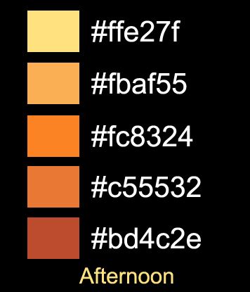

# JavaScript - Node  
## Lista de Exercícios 1 
### Objetivos
- Compreender na prática a aplicabilidade do uso de JavaScript no Backend com NodeJs 
- Reforçar os conceitos de consumo de API e processamento assíncrono.  
- Exercítar lógica de programação e a habilidade de interpretação de especificação técnica. 
- Exercítar o desenvolvimento de sistemas usando metodologias ágeis, trabalhando em equipes e simulando o ambiente de trabalho de uma empresa de TI. 

#### Palavras Chave  
- node, server, backend, http, API, endpoint, agile, scrum, kanban
---
### Instruções Adicionais 
- Este exercício foi concebido para ser resolvido em grupo, podendo a equipe ser formada por até 6 integrantes. Iremos simular o ambiente e a metodologia de trabalho de uma empresa de desenvolvimento de software. 

- Todos os integrantes desempenharão o papel de desenvolvedor. 
- A um integrante será atríbuido o papel adicional de Scrum Master (definido pela equipe).  O Scrum Master é quem modera as reuniões da equipe (As cerimônias do Scrum). Ele é responsável por manter a adesão da equipe à metodologia Agile. Isso significa não apenas presidir as reuniões, mas monitorar se cada integrante está realizando as taréfas de acordo com a metodologia (se está documentando a taréfa, se está evoluindo os cards no Kanban, se está respeitando os prazos, se os integrantes estão respeitando os limites de seus papéis, etc). Caso detecte algum desvio, o Scrum Master deve agir como facilitador, orientando o integrante sobre como deve proceder para corrigir o desvio. 
- Outro integrante acumulará o papel de Tech Lead(definido pelo instrutor).  
O Tech Lead, além de desenvolver/programar, também é o ponto focal para criar o repositório no GitHub e consolidar as alterações enviadas pelos desenvolvedores.   
O Tech Lead também é uma espécie de líder técnico, dúvidas sobre o projeto devem, em primeira instância, ser discutidas com o Tech Lead. Caso o Tech Lead não consiga resolver as dúvidas dos desenvolvedores, este buscará suporte com o Product Owner.  
- O instrutor desempenhará os papeis de Analista e Product Owner. 

- **Kanban:** O instrutor criará o Quadro Kanban no Trello e concederá acesso a cada integrante da equipe. 
- **GitHub:** O Tech Lead criará um repositório para a equipe e concederá acesso a cada integrante da equipe. 
---
### O Projeto 

#### **Descrição Funcional**

Deseja-se desenvolver um Relógio-Despertador que além de apresentar a hora atual, também apresente alguns dados meteorológicos relativos a cidade onde o usuário reside (Temperatura do dia e previsão do tempo do dia).   
O relógio também deve apresentar a data atual e uma mensagem de boas vindas personalizada (que mudará de acordo com o horário do dia).   
O usuário também deseja ser capaz de programar alarmes (função despertador) para horários específicos. Para cada alarme deve ser possível programar um lembrete que será exibido na tela quando o alarme disparar.   
O relógio deverá ter seu próprio mecanismo de contagem de tempo (não deve pegar a hora do sistema) e de tempos em tempos deve sincronizar a Hora Certa com a hora do servidor automaticamente.  
O formato da hora, a escala de temperaturas e a cidade do usuário devem ser configuraveis. 
As telas devem ser responsivas e se adaptar a celulares assim como à telas maiores. 

---
#### **Descrição Técnica**

#### **Interface** 
- A interface com o usuário será desenvolvida em HTML, CSS e JavaScript. Serão criadas 4 telas:    
   a. Tela Principal: Exibirá o relógio, a previsão do tempo e mensagens ao usuário;   
   b. Config: Cadastrar as configurações e preferências do usuário;   
   c. Alarm: Exibe todos os alarmes programados e permite desabilitar os alarmes individulamente;   
   d. New Alarm: Permite cadastrar um novo alarme.   

#### **Design** 

- As telas deverão seguir as seguintes palhetas de cores de acordo com as faixas de horários abaixo: 

    Do nascer do Sol até 12h   
      
 
    Das 12:00:01 até (pôr do sol - 00:30:00)   
      

    Do pôr do sol até 22:00:00   
      

    Das 22:00:01 até o nascer do Sol   
      

    b. A palheta Neutral pode ser usada livremente como complemento às palhetas acima. Dica, use a palheta Neutral como base e aplique as palhetas coloridas para os detalhes. 

    

#### **Detalhamento das Telas** 

**Protótipo das Telas**  
https://www.figma.com/proto/tmxJZeUMoXlNqNq5Vxr2Tv/Despertador-E21?node-id=9%3A238&scaling=scale-down&page-id=0%3A1&starting-point-node-id=9%3A238&show-proto-sidebar=1

**Tela 1**  

  a. Invocar o método getClima(cidade), endpoint /clima?cidade='Blumenau', a cada 15 minutos e atualizar a tela caso necessário.   
  b. Invocar o método getHoraCerta(), endpoint /horaCerta, a cada hora cheia e sincronizar o relógio.    
  c. Invocar o método getHoje(), endpoint /hoje, sempre que o relógio virar das 11:59:59 para as 12:00:00 e atualizar o campo na tela.  
  d. Invocar o método getMsn(), endpoint /msn, a cada hora cheia e atualizar a mensagem na tela conforme necessário.  
  e. Ao disparar do alarme atualizar o campo com o lembrete do alarme correspondente e   
  tocar um Ringtone pelo sistema de áudio do computador.   
    
     Ringtones podem ser obtidos nos sites:  
~~~     
      https://www.zedge.net/ringtones   
~~~
~~~
      https://www.prokerala.com/downloads/ringtones/
~~~ 
  O lembrete deve ser lido do vetor 'alarmes' (veja mais detalhes na descrição da tela 4 .     
  f. Botão multi-funcional, quando o alarme estiver disparado o botão desliga o alarme, no restante do tempo o botão chama a tela 3 (Alarm).   

  Desligar Alarme:  
    1. Limpar o campo lembrete;   
    2. Desligar o ringtone;    
    3. Trocar o texto do botão para "Set Alarm".  

  
  g. Link para a tela 2 (Config). 

   

  

**Tela 2**  

  a. Invocar o método postConfig(formatoHora, escalaTemp, cidade, sexo, nome), endpoint 
  /config?formatoHora=''&escalaTemp=''&cidade=''&sexo=''&nome=''.   
  b. Link para a tela principal.  
  c. Ao carregar a tela, invocar o método getConfig(), endpoint /config, e carregar os dados retornados na tela.   

  

**Tela 3**  

  a. Link para a tela 4 (New Alarm).  
  b. Link para a tela principal.  
  c. Ao Carregar a tela, buscar os dados de todos os alarmes configurados e exibir na tela. Ao mudar o valor de um checkbox, alterar o valor também no vetor 'alarmes'.  

  

**Tela 4**  

  a. Salvar os dados da tela no vetor 'alarmes'. Os dados deverão ser montados em um JavaScript Object com o seguinte layout: 
~~~
  {  
    isAtivo : true,   
    hora: '10:30:00',   
    isAm: true,   
    descricao: 'Lunch with the new Customers'   
  }  
~~~

  Obs. O vetor 'alarmes' deverá ser instânciado no Frontend

  b. Link para a tela principal

  

#### **Detalhamento do Backend** 

**Lista de Endpoints**

  a. Informações Meteorológicas 
    
  Função: getClima(cidade)
  Mapeamento: ( GET ) /clima?cidade='Blumenau'    
  Retorno:  
  ~~~  
  {    
    tempMin: 15,     
    tempMax: 25,    
    tempNow: 20,     
    condition_code: '28',     
    sunrise: '06:47 am',    
    sunset: '05:28 pm'    
  }     
  ~~~

  b. Hora Certa
    
  Função: getHoraCerta()
  Mapeamento: ( GET ) /horaCerta  
  Retorno: 
  ~~~   
  {    
    horaCerta: '10:00:01'  
  }  
  ~~~  

  c. Data Hoje   

  Função: getHoje()
  Mapeamento: ( GET ) /hoje  
  Retorno:   
  ~~~ 
  {    
    hoje: 'Fri Jun 17th, 2022'   
  }  
  ~~~  
  
  d. Mensagem de Boas Vindas
  
  Função: getMsn()
  Mapeamento: ( GET ) /msn
  Retorno:   
  ~~~
  {  
    msn: 'God Afternoon  Mr.  Hendrik, its 12:30 pm'  
  }  
  ~~~  
  
  e. Cadastro de Configurações 
    
  Função: postConfig(formatoHora, escalaTemp, cidade, sexo, nome)
  Mapeamento: ( GET ) /config?formatoHora=''&escalaTemp=''&cidade=''&sexo=''&nome=''   
  Retorno:   
  ~~~
  {    
    status: 1,   
    mensagem: 'campo cidade não informado'      
  }   
  ~~~
  Status:  
  0 - Sucesso   
  1 - Erros de consistencia nos dados   
  2 - Outros erros   
  
  Obs. Este Endpoint, em uma API do tipo REST, tem que ser obrigatórimente do método POST.     

  f. Buscar Configurações 

  Função: getConfig()
  Mapeamento: ( GET ) /config   
  Retorno:   
  ~~~
  {
    status: 0, 
    mensagem: 'sucesso',   
    value:
      {    
        formatoHora : '12',   
        escalaTemp : 'C',  
        cidade: 'Blumenau',   
        sexo: 'Mr'   
      } 
  }
  ~~~  

**Funções**

  a. getClima(cidade)  

  Efetuar uma requisição para a API https://hgbrasil.com/status/weather  

  Para buscar as condições climáticas por cidade, será necessário antes descobrir qual é o WOEID da cidade consultada.   
  O WOEID (Where On Earth IDentifier) é uma API do Yahoo. Para simplificar e diminuir a complexidade, crie um vetor com todas as cidades dos integrantes da equipe e respectivos WOEID. A função então buscará o WOEID no vetor correspondente e utilizará na API da HG Brasil. 

  Retorno:  
  ~~~  
  {    
    tempMin: 15,     
    tempMax: 25,    
    tempNow: 20,     
    condition_code: '28',     
    sunrise: '06:47 am',    
    sunset: '05:28 pm'    
  }     
  ~~~

  b. getHoraCerta()  
  Pegar a hora do Sistema. 

  Retorno: 
  ~~~   
  {    
    horaCerta: '10:00:01'  
  }  
  ~~~

  c. getHoje()  
  Pegar a data atual e formatar a String de saída conforme exemplo abaixo. 

  Retorno:   
  ~~~ 
  {    
    hoje: 'Fri Jun 17th, 2022'   
  }  
  ~~~  

  d. getMsn()
      
    1. Adquirir a hora do pôr do sol através da função getClima(cidade).
    2. Adquirir o nome do usuário no cadastro do sistema, função getConfig(). 
    3. Determinar qual das seguintes mensagens será retornada:   

      Das 00:00:00h até às 11:59:00h responder "God Morning 'name',  its ??:??:?? 'hourStand'"   
      Das 12:00:00h até 4 horas antes do pôr do sol, responder "God Afternoon 'name', its ??:??:?? 'hourStand'"   
      De (4 horas antes do pôr do sol + 1seg.) até o pôr do Sol, responder "God Evening 'name', its ??:??:?? 'hourStand'"   
      De (pôr do Sol + 1seg.) até às 23:59:00h, responder "God Night 'name', ist ??:??:?? 'hourStand' tomorow the sun will rises at 'Sunrise'"   

    onde,   
       name = nome do usuário   
       ??:??:?? = hora atual em formato 12h ou 24h de acordo com o parâmetro nmTimeFormat  
       hourStand = 'am' ou 'pm' se se nmTimeFormat = 12; "o'Clock" em horas Cheias (11:00:00, 22:00:00, etc); 'hours' em todos os demais casos 
       Sunrise = hora do nascer do sol no dia seguinte (adquirir via API)

  Retorno:   
  ~~~
  {  
    msn: 'God Afternoon  Mr.  Hendrik, its 12:30 pm'  
  }  
  ~~~  

  e. postConfig(formatoHora, escalaTemp, cidade, sexo, nome)

  Efetuar a consistencia dos campos recebidos, caso algum campo contenha algum dado inconsistente, retornar o Status 1 e uma mensagem condizente. 

  Caso todos os dados estejam consistentes, gravá-los em um arquivo sequencial e retornar Status 0. 

  Caso a operação de gravação do arquivo retorne erro, devolver status 2 e a mensagem de erro correspondente. 

  Retorno:   
  ~~~
  {    
    status: 1,   
    mensagem: 'campo cidade não informado'      
  }   
  ~~~
  Status:  
  0 - Sucesso   
  1 - Erros de consistencia nos dados   
  2 - Outros erros

  f. getConfig()

  Ler dados do arquivo do sistema e retorná-los. Caso a leitura incorra em erro, retornar o Status 2 e a mensagem de erro correspondente. Caso a leitura seja bem sucedida, retornar os dados, status 0 e mensagem "sucesso". 

  Retorno:   
  ~~~
  {
    status: 0, 
    mensagem: 'sucesso',   
    value:
      {    
        formatoHora : '12',   
        escalaTemp : 'C',  
        cidade: 'Blumenau',   
        sexo: 'Mr'   
      } 
  }
  ~~~

---
  #### **Backlog**

  O Backlog abaixo já está devidamente priorizado, no entanto, pode ser necessário um maior detalhamento dos tópicos ou mesmo quebrar alguma tarefa em tarefas menores (A Equipe deverá analisar o Backlog. Caso decida fazer ajustes, alinhar préviamente com o Product Owner).   

  1. Criar Servidor em NodeJS. Mapear apenas um Endpoint para testar a resposta do Servidor. 

  2. Criar folha de estilos utilizando as palhetas de cores propostas e protótipo das telas. As folhas de estilos devem ser totalmente baseadas em seletores de classes (não usar outros tipos de seletores). Criar também a documentação da folha de estilos para ser utilizada pelos desenvolvedores do Frontend. 

  3. Criar Endpoint 'a'

  4. Criar Endpoint 'b'

  5. Criar Endpoint 'c'

  6. Criar Endpoint 'd'

  7. Criar Endpoint 'e'

  8. Criar Endpoint 'f'

  9. Criar Tela 4

 10. Criar Tela 2

 11. Criar Tela 3
  
 12. Criar Tela 1

