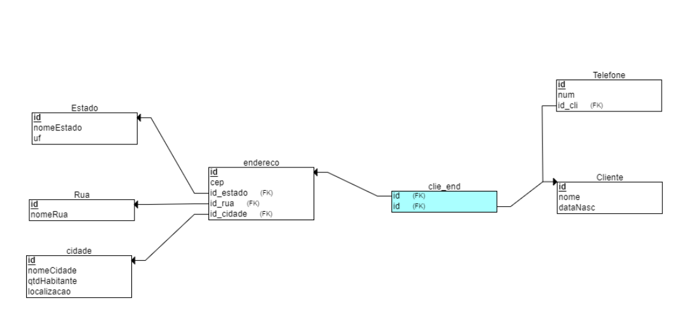

## Entendendo Relacionamento entre Entidades/Tabelas (PK-FK)

## Sintaxe básica dos principais comandos SQL 

### DML - Data Manipulation Language 
~~~
SELECT column1, column2, ...
FROM table_name
WHERE;

INSERT INTO table_name (column1, column2, column3, ...)
VALUES (value1, value2, value3, ...);

INSERT INTO table_name
VALUES (value1, value2, value3, ...);

UPDATE table_name
SET column1 = value1, column2 = value2, ...
WHERE condition;

DELETE FROM table_name 
WHERE condition;
~~~

