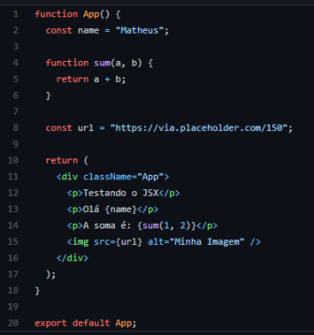
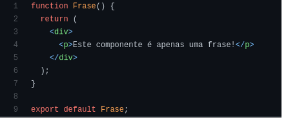
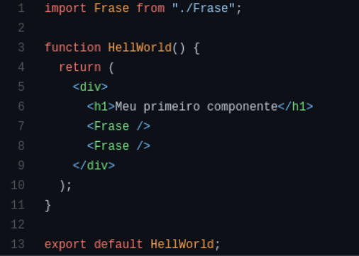
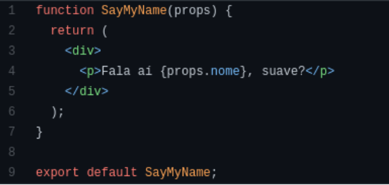
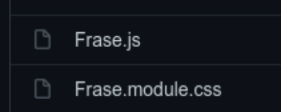
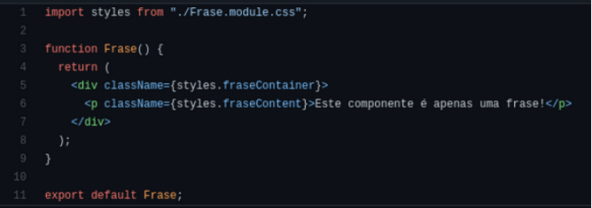
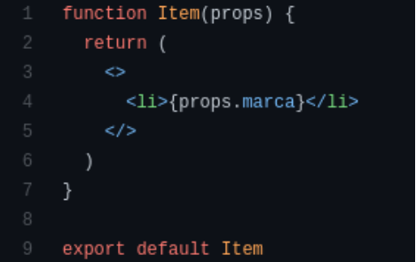
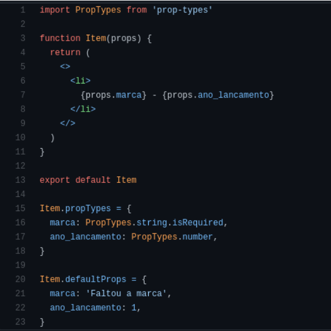
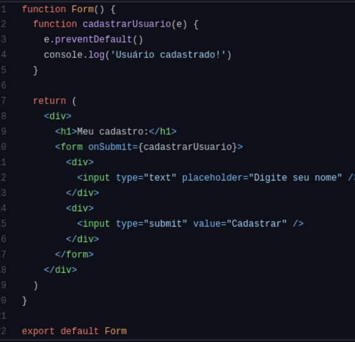

# REACT 

- É uma biblioteca JS para criação de interfaces 
- É utilizado para construir SPAs (Single Page Application)
- Baseado em componentes
- Utiliza JSX para renderizar HTLM 
- Conceito de Virtual DOM  

## Angular vs. React 

|**Angular**| **React**|
|:-----|:-----|
|Google|Facebook|
|Framework Estrutural|Biblioteca|
|MVC|---|
|Estrutura Rígida|Sem Estrutura|
|Componentes maiores|Mais focado em Componentes|
|Código mais específico|Mais foco em reusabilidade|
|Curva de Aprendizagem Conga| Curva de Aprendizagem Curta|
|Aplicações mais sólidas|Indicado quando conteúdo dinâmico é intenso|
|TypeScript|JavaScript|
|Usa Injeção de Dependencias|Não usa injeção de dependências|
|Two-Way Data Binding| One-way Data Binding|

### Empresas

|**Angular**| **React**|
|:-----|:-----|
|Gmail|Instagram|
|Microsoft|Netflix|
|Upwork|Dropbox|
|Sonny|Uber|
|Forbes|Airbnb|
|PayPal|Yahoo|
|GoPro|Asana|
|AWS|Intercom|

### Glosário 
- https://pt-br.legacy.reactjs.org/docs/glossary.html 

## Instalação do React

A instalação do React pode ser feita de diversas maneiras, mas a atual melhor escolha é o create-react-app. 

Um script que podemos executar através do npm, que cria a estrutura base para um projeto
em React. 

**Você pode utilizar os comandos:** 

~~~
>> npx creat-react-app helloworld

>> cd helloworld

>> npm start
~~~

Com estes comandos você tem uma aplicação funcional de React rodando na sua máquina.

## JSX

JSX é a principal maneira de escrever HTML com o REACT. 

O JSX é como um HTML, porém dentro do código JavaScript. 

Podemos realizar diversas outras ações, como imprimir dados de variáveis em nossos templates. Também é possível executar códigos de JavaScript, como um "if".

Você pode escrever JSX no arquivo App.js do React, ou em qualquer componente, veja abaixo um exemplo de JSX. 

Note que é muito semelhante ao HTML, mas precisamos evitar algumas palavras como class, que pertende ao JavaScript, então colocamos className.

Podemos interpolar variáveis inserindo ela entre {}.

É possível inserir valores em atributos de tags, assim como no HTML. 

Encontre mais em: https://legacy.reactjs.org/docs/introducing-jsx.html

## Componentes 

Componentes fazem parte da arquitetura do React.  

Em uma aplicação podem existir diversos componentes, que são partes do site em
proporções menores, por exemplo: barra de navegação, card de
produto, título da página. Todos estes casos podem ser divididos em componentes.

Uma das grandes vantagens dos componentes é que eles podems ser reaproveitados em diversos locais dentro da aplicação.

**Exemplo de Componente**

Normalmente os componentes ficam na pasta **components**

Precisamos criar uma função e exportá-lo.

Note que aqui também utilizamos o JSX, que é retornado entre parenteses, pois possui mais de uma linha de código.  

Para utilizar este componente precisamos importá-lo em um arquivo, veja:

**Exemplo de importação:**

Utilizamos o componente como uma tag, com a sintaxe <Frase />. Note que há o fechamento da tag também. 

O nome do componente é refletido pelo qual foi importado, como podemos ver na primeira linha do código.

## PROPS

Props são os dados que passamos do componente pai para o componente filho.

Na maioria das vezes nós não modificamos estes dados, ou seja, só os utilizamos.

É um recurso extremamente utilizado em React.

Aqui o componente SayMyName aceita a props.

E nele utilizamos a props chamada nome.

Perceba que precisamos declarar na criação da função.

Agora veja como passar as props para o componente que as aceita:

Aqui reutilizamos o componente SayMyName três vezes, em cada um passamos um nome diferente.

Vimos dois recurso sendo utilizados:
- Passagem de props;
- Reutilização de componentes;

## Adicionando CSS

Para adicionar CSS a nossa aplicação temos acesso a um recurso chamado CSS Modules.

Basta criar um arquivo com o mesmo nome do componente que queremos colocar estilos finalizando com **module.css**
Então se temos um componente chamado Frase.js

Vamos criar o arquivo Frase.module.css

No componente vamos importar o nosso arquivo de CSS e acessar as classes que foram definidas nele inserindo estas nos elementos do nosso componente, e esta é a implementação final:

Importamos o CSS com o nome de styles (que é um padrão bastante utilizado).

Acessamos as classes definidas no CSS como propriedades de um objeto.

Agora nosso componente tem CSS!

## Fragments

Sempre que definimos um componente precisamos retornar apenas um elemento.   
Os fragments resolvem este problema, simplificando o nosso HTML.   
Podemos então retornar uma espécie de tag especial, que permite um componente retornar dois ou mais elementos.  

**Veja a implementação:**

Aqui retornamos um li apenas, com o fragment que possui a seguinte sintaxe: <> ... </>, ou seja, abrimos uma tag de fragment e depois precisamos fechá-la. 

## Tipos de Props 

Podemos definir o tipo de uma props e também valores default para ela.  
Isso deixa nosso programa muito mais sólido, limitando o que ele aceita para um melhor funcionamento. 

**Veja o exemplo:**  

Para definir o tipo precisamos importar prop-types.  

E depois aplicar as propriedades os tipos que queremos definir.  

Para definir um valor default não é necessário importar nada, porém precisamos criar a propriedade defaultProps e inserir o valor padrão para as que precisamos.  
Isso faz com que se não passarmos valor nenhum, o valores default sejam exibidos no lugar de um valor vazio, o que pode ser interessante em diversos casos. 

## Eventos

Os eventos do React são recursos fundamentais para tratar os envios de dados dos usuários, como por exemplo, o envio de um formulário.  
Então, para cada ação teremos um evento (clique, teclas, formulários e etc.).  

**Veja um exemplo:**

O evento de submit dispara um método, ou seja, uma função, e nela podemos executar um código baseado na lógica da nossa aplicação. 

## Hooks - useState

## Passar Eventos por Props 

- Pode-se passar uma referência à um método pelas Props de forma que é possível um componente filho ativar o método do seu ancestral; 
- Esses métodos são acessados por meio de um Evento;
- A sintaxe é a mesma de uma props de dados: props.meuEvento.

## Renderização condicional

## Renderização de listas 

## Elevando o State

## Router 

~~~
>> npm install react-router-dom
~~~

## React Icons

https://react-icons.github.io/react-icons/

~~~
>> npm install react-icons --save
~~~

## Adicionar Bootstrap ao React

1. Instalar o bootstrap como uma dependencia externa 
~~~
>> npm install bootstrap
~~~

2. Importar o bootstrap no index.js

import 'bootstrap/dist/css/bootstrap.min.css';
import 'bootstrap/dist/js/bootstrap.bundle';
