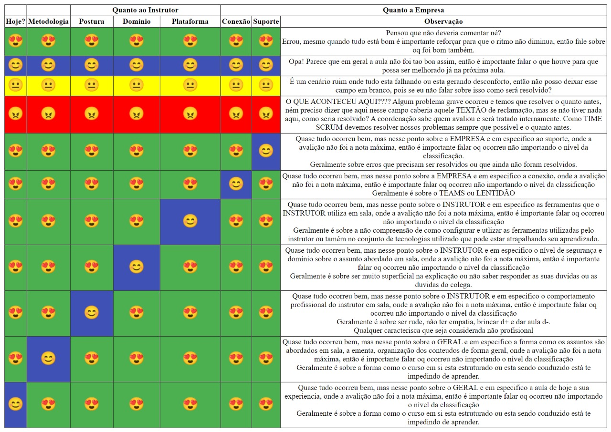

"Aula dada é aula estudada HOJE!" (Pierluigi Piazzi)

"A simplicidade é o mais alto grau de sofisticação" (Leonardo da Vinci)

"O mundo ama os talentosos, mas recompensa os disciplinados" (Autor Desconhecido)

"Sorte é o que acontece quando a preparação encontra a oportunidade" (Sêneca)

"Não se pode ensinar alguma coisa a um homem; apenas ajudá-lo a encontrá-la dentro de si mesmo" (Galileu)

"O fracasso não é o oposto do sucesso. Ele é parte do sucesso!" (Ariana Huffington)

"Vaca não dá leite!" (Mario Sérgio Cortela)

---
## Resumo
~~~
Inicio        : 2023.08.14 
Fim           : 2024.03.01
Horário       : 13:30h - 17:30h 
Carga Horária:
-   Disciplinas Técnicas        : 360h/a
-   Inglês                      : 80h/a
-   Desenvolvimento Humano      : 20h/a
-   Empreendedorismo e Inovação : 8h/a 
-   Contabilidade e Finanças    : 12h/a
Aula Magna: 2023.08.28 
Ciclo de Palestras: 2023.12.05 
Feriados e Emendas: 2023.09.07 e 2023.09.08
                    2023.10.12 e 2023.10.13
                    2023.11.02 e 2023.11.03 e 2023.11.15
Recesso/Férias: 2023.12.22 - 2024.01.12 
Formatura e Mostra de Talentos: 2024.02.28 - 2024.02.29
Último dia de Aula: 2024.03.01 
~~~
## Backlog - Cronograma de entregas 

#### Deadline: 2023.10.26 - postergado para 2023.10.29 4:00am (SUN)
- [x] Projeto Cifra de César (tempo estimado 4h)

#### Deadline: 2023.10.30 4:00am (MON)
- [x] Projeto Verificador de Força de Senha (tempo estimado 6h)
- [x] Formulário Auto-Avaliação (tempo estimado 40min)

#### Deadline: 2023.10.30 1:30pm (MON)
- [x] Lista de Exercícios 8 (tempo estimado 2h)

#### Deadline: 2023.11.05 4:00am (SUN)
- [x] Projeto Precificação Pizzas (tempo estimado 8h)
- [x] Prova multipla escolha, logica e JavaScript - Recuperação (Opcional - tempo estimado 2h) 

#### Deadline: 2023.11.13 4:00am (MON)
- [ ] Projeto Conversor de Moedas usando API (tempo estimado 8h)

---
## Aulas 
### Aula 1 - 2023.08.14 MON - 4h
- Abertura do curso 
- Tarefa de Casa: 
    - Instalar Google Chrome
    - Criar uma conta no Google 
### Aula 2 - 2023.08.15 TUE - 8h

- Off-Topic - Barreiras de entrada no mundo da programação

- GIT - Introdução à Git e GitHub
   - O que são versionadores de Arquivos/Código 
   - Breve resumo da história 
   - Versionadores centralizados e distribuídos 
   - Repositórios remotos compatíveis com Git 
   - Instalação do GIT
   - Criação de Conta no GitHub
   - Clonando um repositório com Git 
- GIT - Organização do Curso e Materiais de aula

### Aula 3 - 2023.08.16 WED - 12h

- GIT - Introdução à Git e GitHub
   - Configurando algumas variáveis
   - Inicializando um repositório local 
   - Adicionando arquivos ao staged 
   - Consolidando alterações 
   - Mapeando um repositório remoto
   - Enviando as alterações para o repositório remoto (Sincronizando o Rep. Remoto)
   - Clonando um repositório remoto 
   - Primeiro fluxo de trabalho (modelo para trabalho individual)
- GIT - Exercícios Lista 1 - Git

- Criação de Conta no GitHub
- Tour no GitHub
    - Ambientação 
    - Criando um novo repositório 
    - Adicionando arquivos ao repositório manualmente 
    - Consolidando alterações (Commit)

### Aula 4 - 2023.08.17 THU - 16h

- Instalação e Ambientação no Visual Studio Code

- GIT - Adicionando e Consolidando as alterações em um único comando (git commit -am)
- GIT - Removendo arquivos do repositório (git rm)
- GIT - Removendo arquivos do Staged
- GIT - Excluído alterações no arquivo em trabalho (antes do ADD...) 
- GIT - Verificando o Log
- GIT - Verificando as diferenças entre Commits
- GIT - .gitignore
- GIT - readme.md
- GIT - MarkDown 

### Aula 5 - 2023.08.18 FRI - 20h

- Off-Topic - Lightshot (Organização, Documentação e Eficiência)
- GIT - Markdown - Documentação Oficial e mais alguns exemplos 
- Projeto - Criação do Understanding Document em Markdown

- HTML - Introdução (O que é, para que serve, um pouco da história)
- HTML - Introdução (Elementos, Tags, Atributos)
- HTML - Introdução (Estrutura de um arquivo HTML, Comentários, Tags de Cabeçalho)

### Aula 6 - 2023.08.21 MON - 24h 

- HTML - Charset 
- HTML - Comentários
- HTML - Principais Tags do HTML ( Títulos, Parágrafos, Imagens, Links, Listas)
- HTML - Um Pouco sobre Formatação com HTML (b, Strong, i, em, big, small, del, s, mark )
- HTML - Exercício 1

### Aula 7 - 2023.08.22 TUE - 28h 

- HTML - Materiais complementares
- HTML - Indentação do código HTML
- HTML - Tipos de Link 
- Off-Topic - Live Server
- HTML - Tags semânticas (header, main, footer, section, nav, article, aside)
- HTML - Elementos estruturais não semânticos (div, span)
- HTML - Exercício 2 

### Aula 8 - 2023.08.23 WED - 32h   

- HTML - (Tabelas, Vídeo, Audio, details + summary)
- HTML - (Layout baseado em tabelas vs. Layout livre de tabelas (Entendendo o valor semântico das tags do HTML))
- Block-level Elements vs. Inline Elements

### Aula 9 - 2023.08.24 THU - 36h 

- HTML - Exercício 3
- HTML - Correção Exercício 2

- CSS - Sintaxe, Onde declarar, Comentários 
- CSS - Seletores (Elemento, id, Classe, Universal)
- CSS - Display, Elementos de Bloco x Elementos de linha

### Aula 10 - 2023.08.25 FRI - 40h 

- HTML - Correção Exercício 3

- CSS - Propriedades Background, Color 
- CSS - Formatação de texto 
- CSS - Especificidade de seletores 
- CSS - CSS Reset e CSS Normalize

### Aula Magna - 2023.08.28 MON
- Aula Magna - Participação Obrigatória
- Local: Teatro Carlos Gomes (Blumenau)
- Horários:
    - Recepção dos alunos (Presencial): 09:00 às 09:30
    - Recepção dos alunos (Online): 09:45
- Alunos que residem em Blumenau devem comparecer presencialmente.
- Pode levar acompanhantes.
- O link para assistir Online estará disponível na central dos alunos a partir
de 24/08/2023.

### Aula ID - 2023.08.29 TUE
- Prof. Mateus

### Aula 11 - 2023.08.30 WED - 44h 
- CSS - Fontes
- CSS - Margens, Padding, Bordas, outline, Box Model 
- CSS - Formatação para Links
- CSS - Cores

### Aula 12 - 2023.08.31 THU - 48h 
- CSS - Formatação para Listas e Tabelas 
- Projeto - Landing Page
- Projeto - Página que fale sobre formas de diminuir emissões de carbono
- Projeto - Página que fale sobre os benefícios da caminhada para a saúde

### Aula 13 - 2023.09.01 FRI - 52h 
- HTML - iframe 
- Off-topic - Google Agenda 
- CSS - Flexbox
- Off-Topic - Publicando uma página no Github Pages

### Aula 14 - 2023.09.04 MON - 56h 
- Avaliação teórica HTML e CSS (1h)
- HTML - Formularios 
   - Input type=text
   - Label 
   - textarea
   - button 
- Projeto - Formulário de contato

- HTML - Formularios
   - Input Types (button, submit, reset, checkbox, color, date, email, file, number, radio, range, tel, etc)
   - Input Attributes

- Projeto - Refatorar formulário de contato 

### Aula ID - 2023.09.05 TUE
- Prof. Mateus

### Aula 15 - 2023.09.06 WED - 60h 
- HTML - Formularios
   - Select 
   - fieldset
   - legend
   - datalist 
   - output 
   - option 
   - optgroup
   - Form Input Attributes
   - Form Attributes**

- Projeto - Cadastro de Aluno
- Projeto - Tela de Login
- Projeto - Urna eletrônica
    - Importância da comunicação 
    - Importância da adârencia às instruções 
        - O que isso tem haver com marketing pessoal no âmbito profissional 

- Prova de recuperação HTML/CSS

### Feriado - 2023.09.07 THU 

### Recesso - 2023.09.08 FRI 

### Aula 16 - 2023.09.11 MON - 64h 
- CSS - Grid 
- CSS - Max-, Min- Width, Hight
- CSS - Responsividade (Media Query, viewport)
- Lógica - Introdução à lógica de programação
- Lógica - Como o computador surgiu 
- Lógica - Entendendo como um computador funciona 

### Aula ID - 2023.09.12 TUE
- Prof. Mateus

### Aula 17 - 2023.09.13 WED - 68h 
- Lógica - O que é Lógica? (noção empírica vs. Conceito Formal) 
- Lógica - Proposições (entendendo o conceito)
- Lógica - Raciocínio de Relacionamento

- Lógica - Introdução à lógica de programação
    - Lógica de Programação
        - Sequência Lógica
        - Instruções 
        - Variáveis 
        - Algoritmo
            - Formas de representar um algoritmo (Descritivo, Fluxograma, pseudocódigo)
            - As fases de um algoritmo

- Exercícios - Lista 0 (Criação de um algoritmo, Sequencia Lógica)
### Aula 18 - 2023.09.14 THU - 72h 
- Lógica - Introdução à lógica de programação
    -  Proposições  
        - Conceito formal 
        - Leis fundamentais
        - Composição de proposições 
            - Conjunção 
            - Disjunção 
            - Negação 
        - Tabela Verdade 
        - Proposições no processo de tomada de decisão 
    - Proposições nas estruturas de seleção
    - Operadores Relacionais 
    - Operadores Aritméticos 

### Aula 19 - 2023.09.15 FRI - 76h 
- Lógica - Criando o primeiro programa em JavaScript 
    - Declaração de variáveis e tipos de dados (inteiro, real, booleano, caractere) 
    - Comandos de saida (console.log)
    - Lendo os primeiros dados da Tela
    - Indentação

- Lógica - Operações Aritméticas em JavaScript
    - Adição, Subtração, Multiplicação, Divisão, Resto
    - Potenciação, Radiciação(pelo inverso da Potenciação)
    - Cálculo percentual, Regra de 3 
    - Montando fórmulas (usando mais de uma operação em uma única expressão)  
- Lógica - Precedência dos operadores aritméticos
- Exercícios - Lista 1 (Criando os primeiros programas em JavaScript)

### Aula 20 - 2023.09.18 MON - 80h 

- Correção lista 1 parte 1 
- Lógica - Aprofundando Tipagem de dados 
- Lógica - Aprofundando Operações aritméticas
- Lógica - Estruturas de Seleção

- Lógica - Exercícios - Lista 2 (Programas com estruturas de Seleção)

### Aula ID - 2023.09.19 TUE
- Prof. Mateus

### Aula 21 - 2023.09.20 WED - 84h 
- Correção lista 1 parte 2
- Lógica - DOM - Capturando elementos da tela

### Aula 22 - 2023.09.21 THU - 88h 
- Correção lista 2 parte 1
- Lógica - DOM - Capturando elementos da tela
- Lógica - Operadores Lógicos e expressões lógicas 

- Exercícios - Lista 3 (Programas com estruturas de Seleção)

### Aula 23 - 2023.09.22 FRI - 92h 
- Correção lista 2 parte 2
- Lógica - Aprofundando conceitos de Estruturas de seleção

### Aula 24 - 2023.09.25 MON  - 96h 
- Avaliação teórica - Lógica de Programação (Prova múltipla escolha)
- Correção da Prova o vivo comentando todas as questões
- Correção lista 2 (Término) 

### Aula ID - 2023.09.26 TUE
- Prof. Mateus

### Aula 25 - 2023.09.27 WED - 100h 
- Tempo para resolução da lista 3 
- Lógica - Boas Práticas
- Lógica - Teste de Mesa

### Aula 26 - 2023.09.28 THU - 104h 

- Correção Lista 3
- Lógica - Estruturas de repetição 
- Exercícios - Lista 4 (Programas com estruturas de Repetição)

### Aula 27 - 2023.09.29 FRI - 108h 
- Correção lista 4 
- Exercícios - Lista 5 (Programas com estruturas de Seleção e Repetição)

### Aula 28 - 2023.10.02 MON  - 112h 

- Correção L4E10
- Correção lista 5 (E1 ao E3)
- Tempo para resolução Lista 5 

### Aula 29 - 2023.10.03 TUE - 116h 

- Correção lista 5
- Lógica - Manipulação de Vetores 
- Exercícios - Lista 6 (Programas com Vetores simples)
- Correção lista 6

### Aula ID - 2023.10.04 WED
- Prof. Mateus

### Aula 30 - 2023.10.05 THU - 120h 

- Lógica - Funções 
- Lógica - Manipulação de Matrizes
- Exercícios - Lista 7 (Programas com Matrizes e Vetores)

### Aula 31 - 2023.10.06 FRI - 124h 

- Correção Lista 5
- JavaScript - Funções Nomeadas e Funções Anônimas
- Tempo para resolução da lista 7 

### Aula 32 - 2023.10.09 MON - 128h 
- Finalização Correção Lista 5
- JavaScript - Tratamento de Eventos
- Correção Lista 7 

### Aula ID - 2023.10.10 TUE
- Prof. Mateus

### Aula 33 - 2023.10.11 WED - 132h 
- Rápida revisão (tipos de dados)

- Template String 
- String vs. Array 
- JavaScript - Métodos de String

- Projeto: Desafio 1 - Verificador de força de senha 
- Projeto: Desafio 2 - Precificação de Pizzas
- Projeto: Desafio 3 - Cifra de César 

- JavaScript - Mais sobre Tratamento de Eventos
- Exercícios: Refatorar pelo menos 3 Exercícios, a escolha, usando os novos conhecimentos sobre tratamento de eventos

### Feriado - 2023.10.12 THU
- Feriado?? Bom pra resolver o desafio da aula ;) 

### Recesso - 2023.10.13 FRI
- Feriado duplo??? :) - WoW - Perfeito para colocar as pendências da aula em dia, hein? ;)  

### Aula 34 - 2023.10.16 MON - 136h 
- ~~Node~~
- JavaScript - Strings (function eval("2 + 2"))

- JavaScript - Arrow Function
- JavaScript - Funções Auto-Invocadas 

- JavaScript - DOM - Como usar CSS com JavaScript 
- JavaScript - DOM - Criando elementos dinâmicamente via JS
- JavaScript - DOM - Janelas de confirmação

### Aula ID - 2023.10.17 TUE
- Prof. Mateus

### Aula 35 - 2023.10.18 WED - 140h 
- JavaScript - DOM - Criando elementos dinâmicamente via JS (parte 2)
- Acessando Variaveis CSS pelo JavaScript*
- JavaScript - Locais para declarar JS
- Exercícios: Refatorar pelo menos 3 Exercícios, a escolha, extraíndo o JS interno para um arquivo.js

### Aula CF - 2023.10.19 THU 
- Prof. Oscar

### Aula 36 - 2023.10.20 FRI - 144h 
- ~~Complexidade de Tempo e Espaço~~
- Acessando Variaveis CSS pelo JavaScript *Correção do bug da última aula 
- Correção L8E1
- JavaScript - Um pouco mais sobre o comportamento das variáveis (var x let x const)

### Aula 37 - 2023.10.23 MON - 148h

- Correção L7E5 (ordenação de vetores)
- JavaScript - Métodos de Array
- JavaScript - Métodos map, reduce, filter

### Aula ID - 2023.10.24 TUE
- Prof. Mateus

### Aula 38 - 2023.10.25 WED - 152h
- JavaScript - Arrays multidimensionais
- JavaScript - Métodos de Numbers
- Precedência de operadores aritméticos
- Precedência de operadores lógicos
- JavaScript - Avaliação de curto-circuito 
- JavaScript - Operações lógicas bit a bit 

### Aula CF - 2023.10.26 THU 
- Prof. Oscar

### Aula 39 - 2023.10.27 FRI - 156h  
- Preencher formulário Autoavaliação dossiê 2
    https://forms.gle/RwH7E4Uaerfn7sCcA
 
- Dúvidas Cifra de César

- CSS - Bootstrap (O que é, como funciona, instalação, Layout, estilizando formulários)
- Exercícios - Lista 8 

### Aula 40 - 2023.10.30 MON - 160h 
- CSS - Bootstrap (Gerenciamento de Layout)

- Correção Lista 8

- JavaScript - Processamento Assíncrono
- JavaScript - Consumo de API com AJAX
- JavaScript - JSON, XML, etc
- Projeto: Desafio 4 - Conversor de Moedas

### Aula ID - 2023.10.31 TUE
- Prof. Mateus

### Aula 41 - 2023.11.01 WED - 164h  
- CSS - Bootstrap (Utilities)
- JavaScript - Processamento Assíncrono
- JavaScript - Consumo de API com fetcdh e Async/Await

### Feriado - 2023.11.02 THU

### Emenda  - 2023.11.03 FRI

### Aula 42 - 2023.11.06 MON - 168h 
- JavaScript - Consumo de API com fetch() - async/await 
- JavaScript - Estruturas de Dados XML - JSON - JS Obj
- JavaScript - Exemplo Consumo API Moedas

### Aula ID - 2023.11.07 TUE
- Prof. Mateus

### Aula 43 - 2023.11.08 WED - 172h 
- JavaScript - Processamento Assíncrono - Promises
- JavaScript - Processamento Assíncrono - Callbacks

### Aula DH - 2023.11.09 THU
- Profa. Viviane

### Aula 44 - 2023.11.10 FRI - 176h

 Tempo para resolução de desafios

- **Node** 
- Node - Instalação do Node
- Node - Criando e executando aplicações Node
- Node - Modules 
- Node - Criando o primeiro servidor http
- Node - Modulo http - Rotas

### Aula 45 - 2023.11.13 MON - 180h  -----

- Node - NPM: Estrutura de um projeto Node
- Node - NPM: Gerenciador de pacotes NPM e NPX
- Node - NPM: Criando e gerenciando Dependencias usando NPM e GitHub
- Node - NPM: Publicando Módulos no NPM
- Node - NPM: Instalando pacotes no projeto Node 
- Node - Express: Criando uma API com o framework Express
- Node - Express: Roteamento 
- Node - Express: Rotas dinâmicas
- Node - Nodemon

### Aula ID - 2023.11.14 TUE
- Prof. Mateus

### Feriado - 2023.11.15 WED

### Aula DH - 2023.11.16 THU
- Profa. Viviane

### Aula 46 - 2023.11.17 FRI - 184h  

- Git  - ignorando a pasta node_modules
- Node - package.json - script - start/dev
- Node - Express: Respondendo arquivos HTML
- Node - Path: __dirname, normalizando o path  

- Node - Express: Recebendo dados de Formulários por requisições GET
- Node - Express: Recebendo dados de Formulários por requisições POST
- Node - Body-Parser: convertendo o corpo da requisição para JSON
- JavaScript - Fazendo uma requisição POST com fetch() 

### Aula 47 - 2023.11.20 MON - 188h 
- ~~TypeScript~~ 

- Node - Express: express.json() (equivalente ao Body-Parser)
- JavaScript - Desestruturação de Arrays e Objetos (Destructuring) 

- Node - Segurança em aplicaçoes WEB - CORS 
- Node - Middlewares 

- Node - Conceitos básicos de API REST 
- Node - Métodos HTTP e suas responsabilidades 
- Node - Status Codes 

### Aula ID - 2023.11.21 TUE
- Prof. Mateus

### Aula 48 - 2023.11.22 WED - 192h  

- Extenção do Chrome - Json Viewer
- Node - Trabalhando com arquivos estáticos 
- Node - Modulo fs (Consistência em arquivos)
- Node - Desafio Urna Eletrônica

### Aula 49 - 2023.11.23 THU - 196h  

- Postman/Insomnia 
- Node - Dicas/resolução Projeto Urna Eletrônica  

### Aula DH - 2023.11.24 FRI
- Profa. Viviane

### Aula 50 - 2023.11.27 MON - 200h 

- Node - Variáveis de ambiente / process.env.PORT
- Node - Descobrir quais aplicações estão se comunicando por uma porta específica
- Node - Projeto Urna Eletrônica
- Node - CommonJS Modules vs. ES6 Modules

### Aula ID - 2023.11.28 TUE
- Prof. Mateus

### Aula 51 - 2023.11.29 WED - 204h 

- Node - CommonJS Modules vs. ES6 Modules
- Node - Tratamento de exceção/erros  
- Node - Retornando Status Codes nas respostas HTTP
- Node - Segurança em aplicaçoes WEB - Autenticação com JWT 

### Aula DH - 2023.11.30 THU
- Profa. Viviane

### Aula 52 - 2023.12.01 FRI - 208h  

- Node - Segurança em aplicaçoes WEB - Autenticação com JWT (função de Logout)
- JavaScript - LocalStorage e SessionStorage
- JavaScript - Login/Logout no Frontend 
- Node - Exercícios - Procedimentos de Login na Urna Eletrônica

### Aula 53 - 2023.12.04 MON - 212h
- Node - Construindo um CRUD Parte 1/2
- Node - Arquitetura MVC Parte 1

### Aula ID - 2023.12.05 TUE
- Prof. Mateus

### Aula 54 - 2023.12.06 WED - 216h  
- Node - Construindo um CRUD Parte 3/4
- Node - Arquitetura MVC Parte 2

### Aula 55 - 2023.12.07 THU - 220h
- Node - Tempo para Exercício CRUD User  
- Node - Segurança em aplicaçoes WEB - HTTPS
- Node - Segurança em aplicaçoes WEB - HTTP/2 (extra)

### Aula 56 - 2023.12.08 FRI - 224h
- Node - Consumindo uma API no Backend (AXIOS)
- Node - Testes automatizados 
- Node - Segurança em aplicaçoes WEB - Autorização 

### Aula 57 - 2023.12.11 MON - 228h 
- Criação Equipes
- Desafio Despertador

- DB - Introdução 
- BD - O que é um banco de dados
- DB - Tipos de banco de dados
- DB - Conceito de SGBD
- DB - Sistema de Banco de dados 
- DB - Abstração de dados
- DB - Conceitos de Bancos de Dados Relacionais 
- DB - Modelagem conceitual do banco de dados

### Aula ID - 2023.12.12 TUE
- Prof. Mateus

### Aula 58 - 2023.12.13 WED - 232h 
- Metodologia Scrum/Git e GitHub/ Trello 

### Aula DH - 2023.12.14 THU
- Profa. Viviane

### Aula DH - 2023.12.15 FRI
- Profa. Viviane

### Aula 59 - 2023.12.18 MON - 236h  
- DB - DML 
- DB - DQL 
- DB - DTL 

### Aula ID - 2023.12.19 TUE
- Prof. Mateus

### Aula 60 - 2023.12.20 WED - 240h  
- DB - Exercícios 

### Aula DH - 2023.12.21 THU
- Profa. Viviane

### Aula 61 - 2023.12.22 FRI - 244h  
- Node - Persistência de dados em Banco de dados

### 2023.12.23 - 2024.01.14
- Recesso de Final de Ano

### Aula ID - 2024.01.15 MON
- Prof. Mateus
- Volta às Aulas!!!

### Aula 62 - 2024.01.16 TUE - 248h
- DB - Modelagem 

### Aula 63 - 2024.01.17 WED - 252h - 252h
- DB - Modelagem 
- DER

### Aula 64 - 2024.01.18 THU - 256h 
- DB - MER 
- DB - Normalização e Desnormalização 

### Aula 65 - 2024.01.19 FRI - 260h 
- DB - DDL

### Aula 66 - 2024.01.22 MON - 264h 
- DB - DML

### Aula ID - 2024.01.23 TUE
- Prof. Mateus

### Aula 67 - 2024.01.24 WED - 268h 
- DB - DQL 
- Avaliações e Pendencias (Questionário Multipla escolha/Trabalho desertador) 

### Aula 68 - 2024.01.25 THU - 272h 
- DB - Integrando SQL no NODE

### Aula 69 - 2024.01.26 FRI - 276h 
- Apresentação Trabalho Despertador (15min. p/Equipe) 

- **Trabalho de Conclusão** 
    - Organização das equipes 
    - Primeiras Etapas 

### Aula 70 - 2024.01.29 MON  - 280h 
- NODE - Revisão API REST, Arquitetura MVC 
- NODE - Integrando o Banco de dados na API REST e arquitetura MVC
- **TypeScript**
- TypeScript - O que é e para que server TypeScript 

### Aula ID - 2024.01.30 TUE
- Prof. Mateus

### Aula 71 - 2024.01.31 WED - 284h 
- TypeScript - Instalação 
- TypeScript - Compilação/Transpilação 
- TypeScript - Tipagem de variáveis
- TypeScript - Criação de Interfaces
- TypeScript - Object Literals
- TypeScript - Arrays e Tuplas  

### Aula 72 - 2024.02.01 THU - 288h 
- TypeScript - Tipagem de Funções (parametros, retorno e parametros opcionais)
- TypeScript - Criação de Tipos (Objetos e Interfaces)
- TypeScript - Generics 
- POO - Classes vs. Objetos 
- POO - Atributos, Métodos, Construtor 

### Aula 73 - 2024.02.02 FRI - 292h 
- POO - Encapsulamento 
    - modificadores de acesso
    - Getters e Setters
    - Metodos Worker, etc
- POO - Composição 

### Aula 74 - 2024.02.05 MON - 296h 
- POO - Herança
- POO - Abstração 
- POO - Polimorfismo 
- POO - Interfaces 
- POO - Agregação, Especialização, Generalização, Acoplamento  

### Aula ID - 2024.02.06 TUE
- Prof. Mateus

### Aula 75 - 2024.02.07 WED - 300h 
- React - Introdução
- React - Instalação 
- React - JSX
- React - Componentes
- React - PROPS 

### Aula 76 - 2024.02.08 THU - 304h 
- React - CSS   
- React - Fragments
- React - Tipos de Props 
- React - Props Default
- React - Eventos
- React - useState
- React - Passando Eventos por Props
- React - Renderização condicional

### Aula 77 - 2024.02.09 FRI - 308h 
### Aula 78 - 2024.02.13 TUE - 312h <--------
### Aula 79 - 2024.02.14 WED - 316h 
### Aula 80 - 2024.02.15 THU - 320h 
### Aula 81 - 2024.02.16 FRI - 324h 
### Aula 82 - 2024.02.19 MON - 328h 
### Aula 83 - 2024.02.20 TUE - 332h 
### Aula 84 - 2024.02.21 WED - 336h 
### Aula 85 - 2024.02.22 THU - 340h 
- Trabalho de Conclusão 
### Aula 86 - 2024.02.23 FRI - 344h 
### Aula 87 - 2024.02.26 MON - 348h 
### Aula 88 - 2024.02.27 TUE - 352h
### Aula 89 - 2024.02.28 WED - 356h
### Aula 90 - 2024.02.29 THU - 360h <--------  Hi 

### off-topics
- Off-Topic - Publicando uma página no Github Pages
- Off-topic - Google Agenda 
- Off-topic - Google App Script
- Off-Topic - Keepass (Organização, Documentação e Eficiência)
---
## Ferramentas (Setup) 

**Visual Studio Code**
~~~
        https://code.visualstudio.com
~~~

**Google Chrome**
~~~
        Download Google Chrome: 
            https://www.google.pt/intl/pt-PT/chrome/

        Tutorial de Instalacao do Google Chrome: 
            https://canaltech.com.br/navegadores/como-instalar-o-google-chrome/
            https://support.google.com/chrome/answer/95346?hl=pt&co=GENIE.Platform%3DDesktop

        Extensão do Google Tradutor para o Chrome: 
            https://canaltech.com.br/utilitarios/conheca-a-extensao-do-google-tradutor-para-o-chrome/

~~~

**Git**
~~~
        https://git-scm.com/
~~~

**NodeJS**

~~~
        https://nodejs.org/en/download/
~~~

**Postman**
~~~
        https://www.postman.com/downloads/
~~~

**Insomnia**
~~~
        https://insomnia.rest/download
~~~

**Lightshot**
~~~
        https://app.prntscr.com/pt-br/download.html
~~~

**KeePass**
~~~
        https://keepass.info/download.html
~~~

**PostgreSQL**
~~~
    https://www.enterprisedb.com/downloads/postgres-postgresql-downloads
~~~

---
## Links úteis 
    
### Comunicação & Organização do Curso 

- Formulário Autoavaliação Dossiê 2
    https://forms.gle/RwH7E4Uaerfn7sCcA

- Formulário para registrar o Status das Atividades: 
    https://forms.gle/yf7X8LRsMbaPRCt78

- Planilhas Perguntas do dia:
    - Git e GitHub  
        https://forms.gle/M9os3FjgWVAoC6Z48
    - HTML   
        https://forms.gle/N9rdE2pKSdv5mYSy9
    - CSS  
        https://forms.gle/F1gBELnQBA5izc9D8
    - Lógica de Programação  
        https://forms.gle/29nLkax75rnHrhjj8  
          
  
- Planilha Entrega de Exercícios:   
    https://forms.gle/fZZymQsHrqofwg4x8

- Sala de aula no Google:   
    https://classroom.google.com/c/NjE3NjczODQ4OTE3?cjc=ve4uvji

- Central do Aluno:  
    https://externo.proway.com.br/login-aluno

    **Login:** E-mail do cadastro no Entra21 

    **Senha inicial:** data de nascimento no formato: ddmmaaaa

---

## Como devo proceder na avaliação diária?

--- 

## Instrutor 

Ivan J. Borchardt

[99256_2268-WhatsApp-25D366?style=for-the-badge&logo=whatsapp&logoColor=white)](https://wa.me/qr/DRQRLT3OIOMQJ1)         

 

## Coordenadores

### Coodenadora da turma

Rebeca Braatz 

[99602_0064-WhatsApp-25D366?style=for-the-badge&logo=whatsapp&logoColor=white)](https://wa.me/qr/DRQRLT3OIOMQJ1) 

E-mail: rebeca.silva@proway.com.br

### Contato monitoramento 
Anny Karolinyp

[9235_1168-WhatsApp-25D366?style=for-the-badge&logo=whatsapp&logoColor=white)](https://wa.me/qr/DRQRLT3OIOMQJ1) 

### License
This project is under the MIT license.

